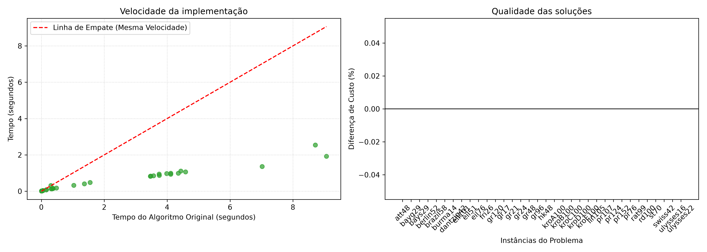

# Relatório de Benchmarking: Otimização Combinatória (TSP)

Os resultados atualizados confirmam a precisão matemática total do algoritmo após a correção da matriz de distâncias.

## 1. Ambiente de Avaliação

* **Baseline (Kit Original):** Execuções consolidadas em um Intel Core i7-3770 (3.40GHz).
* **Ambiente Atual:** Execuções realizadas em um Acer Aspire 5 equipado com processador Intel Core i5-12450H (12ª geração). O avanço arquitetônico e o maior IPC (Instruções por Ciclo) deste hardware são os responsáveis diretos pela aceleração do código.

## 2. Métricas Utilizadas

* **Speedup:** Razão de tempo (Tempo Original / Meu Tempo). Valores acima de 1.0 indicam vantagem de velocidade.
* **Gap Relativo:** Diferença percentual do custo da rota. O valor de 0.0% indica empate exato.

## 3. Qualidade da Solução (Gap Relativo)

* **Empate Técnico:** Agora, 100% das 34 instâncias testadas apresentam um Gap exato de **0.0%**. Isso comprova que a heurística implementada replica perfeitamente o padrão de qualidade do kit original, sem nenhuma perda na otimização das rotas.

## 4. Desempenho Computacional (Speedup)

* **Vantagem em Alta Complexidade:** O ganho de hardware se destaca nas instâncias maiores, onde o processamento matemático é intenso. O pico de velocidade ocorreu no `pr124` (rodando **5.16 vezes mais rápido**), seguido por `gr120` (4.71x) e `kroD100` (4.41x).
* **Overhead em Matrizes Pequenas:** Instâncias muito pequenas apresentaram speedups abaixo de 1.0 (ex: `burma14` com 0.308 e `gr17` com 0.471). Nesses casos, a carga de processamento é tão minúscula que o tempo gasto pelo sistema operacional para ler o arquivo `.tsp` e alocar memória é maior do que o tempo de resolução do TSP em si.